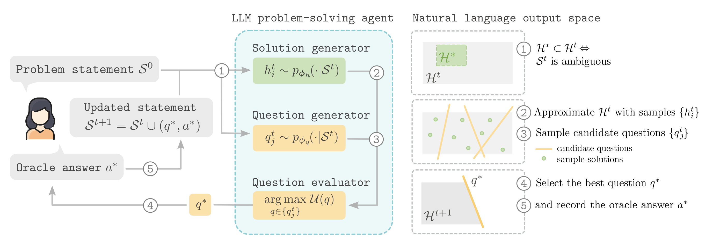

Despite the impressive performance of large language models (LLMs) across various benchmarks, their ability to address ambiguously specified problems—frequent in real-world interactions—remains underexplored. To address this gap, we introduce a formal definition of task ambiguity and frame the problem of task disambiguation through the lens of Bayesian Experimental Design. By posing clarifying questions, LLM agents can acquire additional task specifications, progressively narrowing the space of viable solutions and reducing the risk of generating unsatisfactory outputs. Yet, generating effective clarifying questions requires LLM agents to engage in a form of meta-cognitive reasoning, an ability LLMs may presently lack. Our proposed approach of active task disambiguation enables LLM agents to generate targeted questions maximizing the information gain. Effectively, this approach shifts the load from implicit to explicit reasoning about the space of viable solutions. Empirical results demonstrate that this form of question selection leads to more effective task disambiguation in comparison to approaches relying on reasoning solely within the space of questions.