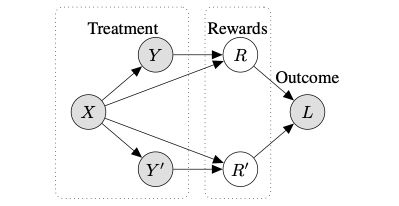

Reward modelling from preference data is a crucial step in aligning large language models (LLMs) with human values, requiring robust generalisation to novel prompt-response pairs. In this work, we propose to frame this problem in a causal paradigm, providing the rich toolbox of causality to identify the persistent challenges, such as causal misidentification, preference heterogeneity, and confounding due to user-specific factors. Inheriting from the literature of causal inference, we identify key assumptions necessary for reliable generalisation and contrast them with common data collection practices. We illustrate failure modes of naive reward models and demonstrate how causally-inspired approaches can improve model robustness. Finally, we outline desiderata for future research and practices, advocating targeted interventions to address inherent limitations of observational data.