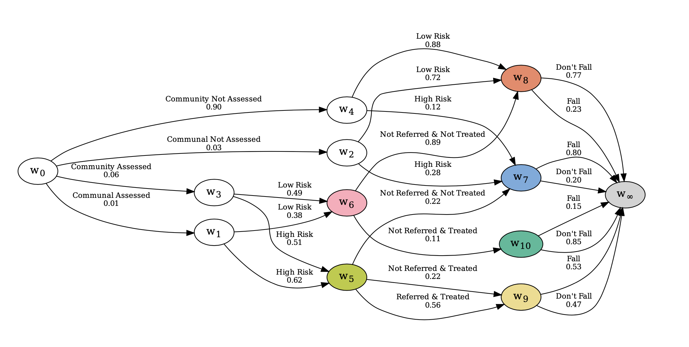

Chain event graphs (CEGs) are a recent family of probabilistic graphical models that generalise the popular Bayesian networks (BNs) family. Crucially, unlike BNs, a CEG is able to embed, within its graph and its statistical model, asymmetries exhibited by a process. These asymmetries might be in the conditional independence relationships or in the structure of the graph and its underlying event space. Structural asymmetries are common in many domains, and can occur naturally (e.g. a defendant vs prosecutor’s version of events) or by design (e.g. a public health intervention). Whilst two CEG packages exist in R for modelling processes with asymmetric conditional independencies, there currently exists no software that allows a user to leverage the theoretical developments of the CEG model family in modelling processes with structural asymmetries. In this paper, we present cegpy—the first Python implementation of CEGs and the first across all languages to support structurally asymmetric processes. cegpy contains an implementation of Bayesian learning and probability propagation algorithms for CEGs. We illustrate the functionality of cegpy using a structurally asymmetric dataset.