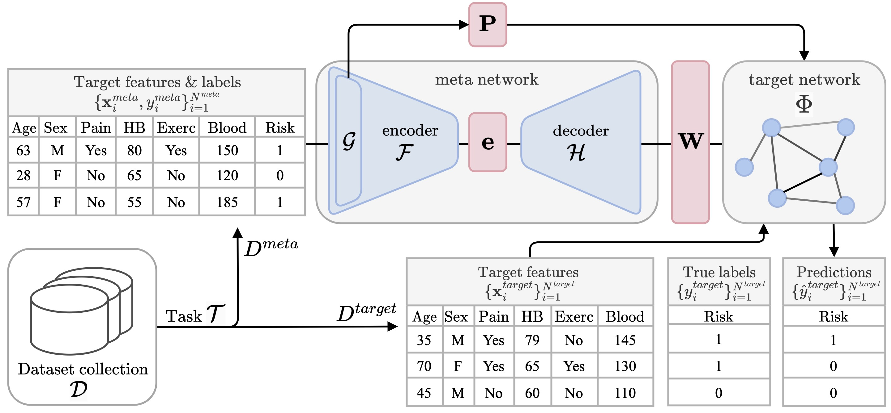

 Despite the prevalence of tabular datasets, learning with just a few labelled examples remains an under-explored area of research. Existing few-shot learning methods are not directly applicable to tabular datasets due to the variation in the relationships between the columns, their underlying meanings, and their permutational invariance. To address these challenges, we propose FLAT—the first solution for the generalized problem of tabular few-shot learning, including the critical aspect of knowledge sharing between datasets with heterogenous sets of columns. Using a Dataset2Vec-inspired encoder, FLAT learns a low-dimensional embedding space of tabular datasets and their individual columns that captures the key characteristics of datasets; this enables knowledge transfer and generalization to previously unseen datasets. Based on the embedding of a new dataset, a decoder network generates the parameters of the predictive target network. To handle the varying number of features, their permutational invariance and structural relationship, we implement the target network as a Graph Attention Network. Using a collection of datasets from the UCI Machine Learning Repository, we demonstrate successful generalization to different tabular datasets and a considerable improvement over existing baselines.

