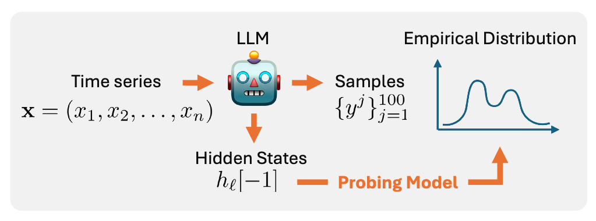

Large Language Models (LLMs) have recently been successfully applied to regression tasks---such as time series forecasting and tabular prediction---by leveraging their in-context learning abilities. However, their autoregressive decoding process may be ill-suited to continuous-valued outputs, where obtaining predictive distributions over numerical targets requires repeated sampling, leading to high computational cost and inference time. In this work, we investigate whether distributional properties of LLM predictions can be recovered *without* explicit autoregressive generation. To this end, we study a set of regression probes trained to predict statistical functionals (e.g., mean, median, quantiles) of the LLM’s numerical output distribution directly from its internal representations. Our results suggest that LLM embeddings carry informative signals about summary statistics of their predictive distributions, including the numerical uncertainty. This investigation opens up new questions about how LLMs internally encode uncertainty in numerical tasks, and about the feasibility of lightweight alternatives to sampling-based approaches for uncertainty-aware numerical predictions.