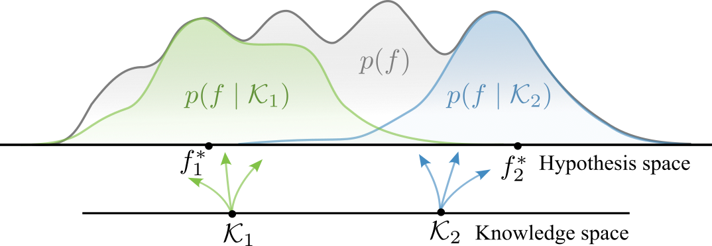

A significant challenge in machine learning, particularly in noisy and low-data environments, lies in effectively incorporating inductive biases to enhance data efficiency and robustness. Despite the success of informed machine learning methods, designing algorithms with explicit inductive biases remains largely a manual process. In this work, we explore how prior knowledge represented in its native formats, e.g. in natural language, can be integrated into machine learning models in an automated manner. Inspired by the learning to learn principles of meta-learning, we consider the approach of learning to integrate knowledge via conditional meta-learning, a paradigm we refer to as informed meta-learning. We introduce and motivate theoretically the principles of informed meta-learning enabling automated and controllable inductive bias selection. To illustrate our claims, we implement an instantiation of informed meta-learning--the Informed Neural Process, and empirically demonstrate the potential benefits and limitations of informed meta-learning in improving data efficiency and generalisation.
