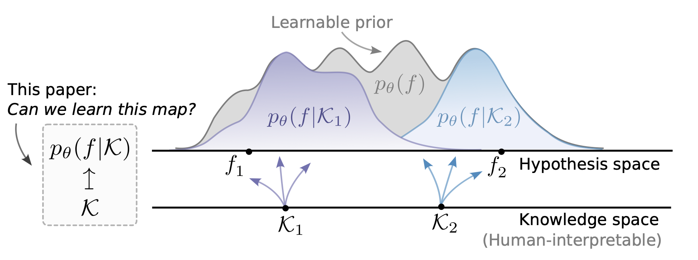

In noisy and low-data regimes prevalent in real-world applications, a key challenge of machine learning lies in effectively incorporating inductive biases that promote data efficiency and robustness. Meta-learning and informed ML stand out as two approaches for incorporating prior knowledge into ML pipelines. While the former relies on a purely data-driven source of priors, the latter is guided by prior domain knowledge. In this paper, we formalise a hybrid paradigm, informed meta-learning, facilitating the incorporation of priors from unstructured knowledge representations, such as natural language; thus, unlocking complementarity in cross-task knowledge sharing of humans and machines. We establish the foundational components of informed meta-learning and present a concrete instantiation of this framework--the Informed Neural Process. Through a series of experiments, we demonstrate the potential benefits of informed meta-learning in improving data efficiency, robustness to observational noise and task distribution shifts.