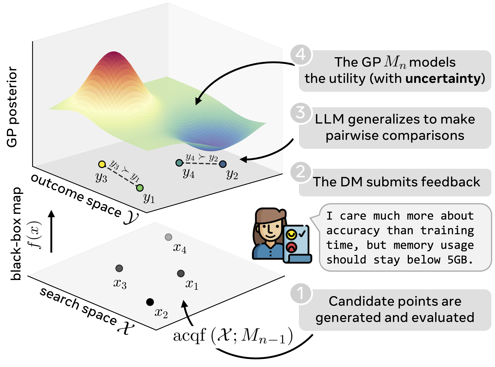

Many real-world optimization problems are guided by complex, subjective preferences that are difficult to express as explicit closed-form objectives. In response, we introduce Language-in-the-Loop Optimization (LILO), a Bayesian optimization (BO) framework that employs a large language model (LLM) to translate free-form natural language feedback and prior knowledge from a decision maker into structured preference signals, going beyond the restrictive scalar or pairwise feedback formats typically assumed in preferential BO. The LLM-derived preferences are integrated by a Gaussian process proxy model, enabling principled acquisition-driven exploration with calibrated uncertainty. By placing the LLM in a supporting role rather than as the optimizer itself, LILO preserves the sample efficiency and stability of BO while providing a flexible and expressive feedback interface. Across synthetic and real-world benchmarks, LILO consistently outperforms both conventional preference-based BO methods and LLM-only optimizers, with particularly strong gains in feedback-limited regimes.