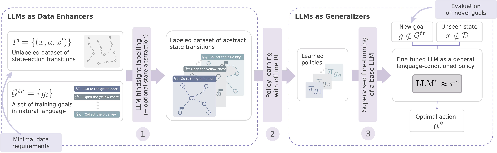

Developing autonomous agents capable of performing complex, multi-step decision-making tasks specified in natural language remains a significant challenge, particularly in realistic settings where labeled data is scarce and real-time experimentation is impractical. Existing reinforcement learning (RL) approaches often struggle to generalize to unseen goals and states, limiting their applicability. In this paper, we introduce TEDUO, a novel training pipeline for offline language-conditioned policy learning in symbolic environments. Unlike conventional methods, TEDUO operates on readily available, unlabeled datasets and addresses the challenge of generalization to previously unseen goals and states. Our approach harnesses large language models (LLMs) in a dual capacity: first, as automatization tools augmenting offline datasets with richer annotations, and second, as generalizable instruction-following agents. Empirical results demonstrate that TEDUO achieves data-efficient learning of robust language-conditioned policies, accomplishing tasks beyond the reach of conventional RL frameworks or out-of-the-box LLMs alone.
